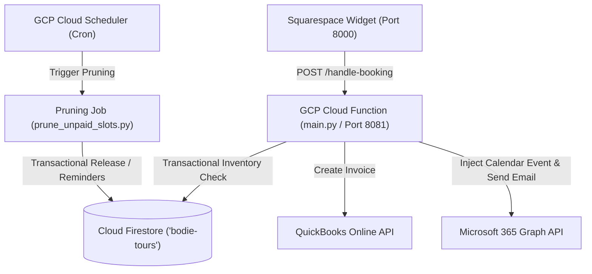

# Bodie State Park Booking System - Master Documentation

Welcome to the unified Master Technical Documentation for the Bodie State Park Booking System. This comprehensive manual details the system architecture, database contracts, third-party integrations, security protocols, test configurations, and deployment strategies.

---

## 1. Overview & System Mission

The **Bodie State Park Booking System** is a modern, secure, serverless backend integration designed to automate visitor tours at Bodie State Park. It acts as the central middleware between a client-side booking widget, Firestore datastores, QuickBooks Online (QBO) for financial transactions, and Microsoft 365 (M365) for park ranger calendars and email receipts.

### Key Milestones Completed
* **Standardized Capacity Schema:** Shifted from legacy `slots` dictionaries to atomic `taken_slots` list capacity schemas, aligning local dev servers with production.
* **Idempotency Hardening:** Implemented stateless, RFC 4122 namespace-based UUIDv5 token tracking across all QBO and M365 calls to eliminate duplicate invoice and calendar entries.
* **Security Remediation:** Addressed 7 core security findings, including HTML injections, permissive CORS, CSRF (Double-Submit Cookie pattern), and exception data leakage.
* **Verification & Testing:** Constructed an extensive test harness containing **321 fully passing tests** covering unit, cross-feature boundary, and end-to-end (E2E) visual flows.

---

## 2. Core Tech Stack & Specifications

* **Backend Environment:** Python 3.12 executing on Google Cloud Functions (Gen 2).
* **Database:** Google Cloud Firestore (Native Mode) with dedicated instance `bodie-tours`.
* **Frontend Widget:** Vanilla HTML5, CSS3, and Squarespace Custom JavaScript (`fetch` API).
* **Payment & Finance:** QuickBooks Online (QBO) OAuth 2.0 API.
* **Scheduling & Messaging:** Microsoft 365 Graph API (Client Credentials / App-Only Auth).
* **GCP Cloud Region:** `us-west2`
* **Default Local Port:** `http://localhost:8081`

---

## 3. Architecture & Data Schema Conventions



### Stateless Design
All Google Cloud Functions are completely ephemeral and stateless. All active states, authorization configs, OAuth tokens, and capacity maps are persisted exclusively inside Cloud Firestore.

### Dual-Collection Schema & Data Air-Gap
To protect visitor privacy and comply with strict data security regulations, a strict architectural barrier (Air-Gap) separates aggregated scheduling capacity and Personal Identifiable Information (PII):

1. **Public Inventory Collection (`/public/{date}`):**
   * Shared capacity schema. Contains zero visitor details (no PII).
   * **Schema fields:**
     ```json
     {
       "date": "YYYY-MM-DD",
       "taken_slots": ["10:00_1_bookingGuestId", "13:00_2_bookingGuestId"],
       "last_updated": "Timestamp"
     }
     ```
   * Unified capacity verification uses `America/Los_Angeles` timezone.

2. **Private Bookings Collection (`/bookings/{booking_id}`):**
   * Encapsulates all visitor details and third-party integration references.
   * **Schema fields:**
     ```json
     {
       "booking_id": "booking_guest_abc",
       "created_at": "Timestamp",
       "tour_datetime": "Timestamp (UTC)",
       "party_size": 2,
       "payment_status": "PENDING | PAID | CANCELLED_BY_GUEST | CANCELLED_UNPAID",
       "reminder_sent": 0,
       "guest": {
         "name": "Alice Guest",
         "email": "alice@example.com",
         "phone": "(123) 456-7890"
       },
       "integration_ids": {
         "qbo_invoice_id": "9872",
         "m365_event_id": "AAMkAGI0..."
       },
       "payment_link": "https://connect.intuit.com/pay/...",
       "token": "secure_random_token_123"
     }
     ```

### Atomic Capacity Reservations
Capacity is booked and released atomically. Every reservation and release uses `@firestore.transactional` to check capacity and alter `taken_slots` in a single isolated transaction, preventing race conditions or double-bookings.

---

## 4. API Endpoints & Interfaces

### Public REST Endpoints
Standardized to use **hyphens** for all publicly exposed HTTP endpoints:
* **`/handle-booking` [POST]:** Processes incoming booking requests, checks capacity, runs Firestore transactions, registers the reservation, and triggers QBO/M365 async loops.
* **`/cancel-tour` [GET, OPTIONS]:** Secures standard user browser redirects. Validates the `booking_id` and unique `token` stored in the Firestore booking document before transactionally releasing the slots.
* **`/m365-free-availability` [GET]:** Standardized retrieval endpoint used by the front-end scheduling widget to check active ranger calendar availability against "Touring Hours".
* **`/qbo-login` & `/qbo-callback` [GET]:** Intuit OAuth 2.0 connection and refresh trigger.
* **`/m365-login` & `/m365-callback` [GET]:** Microsoft 365 OAuth 2.0 authorization sequence.
* **`/retry-unpaid-bookings` [POST]:** Cron background job triggered to rebuild and recover failed invoice links.

---

## 5. Third-Party Integrations & Idempotency Hardening

Downstream integrations with QuickBooks Online and Microsoft 365 are hardened against network drops and retry loops using stateless, hash-deterministic idempotency tokens.

### Hash-Deterministic Token Generation (UUIDv5)
The system leverages RFC 4122 namespace-based UUIDv5 tokens to generate identical identifiers across distributed background threads without database state overhead:
```python
import uuid
# Generates identical tokens on any background retry thread
token = uuid.uuid5(uuid.NAMESPACE_DNS, f"bodie-tours-customer-{booking_id}")
```

### QuickBooks Online (QBO) Idempotency
* **Customer Creation:** Derives a deterministic customer UUID and appends it as `&requestid={token}` on the QBO POST request during resolution or creation. Displays are gracefully auto-indexed if name collisions occur.
* **Invoice Generation:** Appends a deterministic `&requestid={token}` constructed using `bodie-tours-invoice-{booking_id}` on the QBO invoice endpoint, preventing duplicate financial receipts on payment retries.

### Microsoft 365 (M365) Idempotency
* **Calendar Event Injection:** Pre-scans the M365 Outlook calendar for events matching the targeted `booking_id` in the subject or body description *before* initiating any POST creation. If a matching event is found, it returns the pre-existing event ID instantly.
* **Header Injections:** Injects deterministic UUIDs via the standard `client-request-id` header in both calendar event creation and Graph transactional mail dispatch (`/sendMail`), preventing duplicate invites or receipts.

---

## 6. Pruning, Reminders, & Background Jobs

An automated Cloud Scheduler job regularly fires an HTTP trigger to the **Pruning Function** (`prune_unpaid_slots.py`) to transactionally cancel abandoned bookings.

### TTL Calculation & Automated Reminders
* **Booking TTL:** Calculated dynamically using the booking lead time relative to the tour date (longer lead times receive more generous windows; tight bookings must pay quickly).
* **Capped Reminders:** Customers receive at most 2 payment reminder emails. The second reminder is dispatched precisely at the quarter-TTL mark (when 75% of the hold window has elapsed) to maximize conversion before slot release.
* **Html Escaping in Custom Templates:** All template formatting safely parses the calculated dynamic price (`formatted_total`) to prevent the raw string `"None"` from being sent to customers when custom Firestore email templates are loaded.

---

## 7. Security Hardening Report

The system is fully hardened against the 7 security findings listed in `SECURITY-REVIEW.md`:

| # | Severity | File | Vulnerability | Remediation | Status |
|---|----------|------|---------------|-------------|--------|
| 1 | 🔴 HIGH | `main.py` | HTML Injection in M365 Calendar Events | Strictly escape all untrusted customer fields via `html.escape()` before rendering. | **🟢 RESOLVED** |
| 2 | 🔴 HIGH | `main.py` | HTML Injection in Booking Receipts | Format plaintext subjects independently from HTML-escaped bodies. | **🟢 RESOLVED** |
| 3 | 🔴 HIGH | `prune_unpaid_slots.py` | HTML Injection in Reminder Emails | Structured email bodies to strictly escape custom database templates. | **🟢 RESOLVED** |
| 4 | 🔴 HIGH | `main.py` & `prune_unpaid_slots.py` | Sensitive Response Leakage in Logs | Truncated Exception message outputs printing provider raw payloads to 100 characters. | **🟢 RESOLVED** |
| 5 | 🔴 HIGH | `main.py` | CSRF Validation Bypass | Integrated a strict Double-Submit Cookie CSRF pattern (`X-CSRF-Token` validation). | **🟢 RESOLVED** |
| 6 | 🔴 HIGH | `main.py` | OAuth Redirect Hijack Risk | Enforced exact whitelist matches for QBO and M365 callback URLs. | **🟢 RESOLVED** |
| 7 | 🟠 MEDIUM | `main.py` | Overly Permissive CORS Origin Echoing | Replaced substring matching with an exact lookup against a domain whitelist. | **🟢 RESOLVED** |

---

## 8. Test Infrastructure & Verification Suite

A comprehensive test suite of **321 automated python tests** enforces operational correctness:

### Test Tiers
* **Tier 1 (Feature Coverage):** Minimum of 5 isolated checks validating core feature functions (QBO OAuth, invoice generation, M365 availability, pruner, TTL, slot release).
* **Tier 2 (Boundary & Corner cases):** Verifies constraints and edge inputs (empty values, extreme capacity sizes, clock skew, expired tokens).
* **Tier 3 (Cross-Feature interactions):** Validates joint transactions (e.g. reserving slot + injecting calendar + dispatching invoices, checking rollbacks on integration failure).
* **Tier 4 (Real-World Application Scenarios):** Full simulated E2E customer journeys (such as complete bookings, expired booking releases, and QBO token refresh timeouts).

### Running Tests
Execute the test runner locally using `pytest`:
```bash
$ .venv/bin/pytest
```

**Successful Output:**
```text
======================= 321 passed, 3 warnings in 8.53s ========================
```

---

## 9. Non-Technical Deployment & Setup Guide

### 1. Firestore Configuration
Ensure that the Firestore database is set up in **Native Mode** under the name `bodie-tours`. Seed the initial templates into the database using:
```bash
$ python seed_templates.py
```

### 2. QuickBooks Online Integration Setup
1. Log in to the [Intuit Developer Portal](https://developer.intuit.com/).
2. Under your app settings, add the pre-approved exact-match redirect URL:
   * **Production:** `https://us-west2-bodie-tours-prod.cloudfunctions.net/qbo-callback`
   * **Local Dev:** `http://localhost:8081/qbo-callback`
3. Retrieve your Client ID and Client Secret, and store them securely inside Firestore at `config/qbo_auth`.

### 3. Microsoft 365 Setup
1. Open the [Microsoft Entra Admin Center](https://entra.microsoft.com/).
2. Under **App Registrations**, register your application and assign the following Graph API application permissions:
   * `Calendars.ReadWrite` (To inject and manage ranger tours).
   * `Mail.Send` (To dispatch confirmation receipts and reminders).
3. Create a Client Secret and register the pre-approved callback URL:
   * `https://us-west2-bodie-tours-prod.cloudfunctions.net/m365-callback`
4. Store these credentials inside Firestore under `config/m365_auth`.

### 4. Deploying Cloud Functions
Run the deployment script to ship your code to Google Cloud Platform:
```bash
$ ./deploy_functions.sh
```
This builds and deploys all 10 endpoints safely under the production environment.
