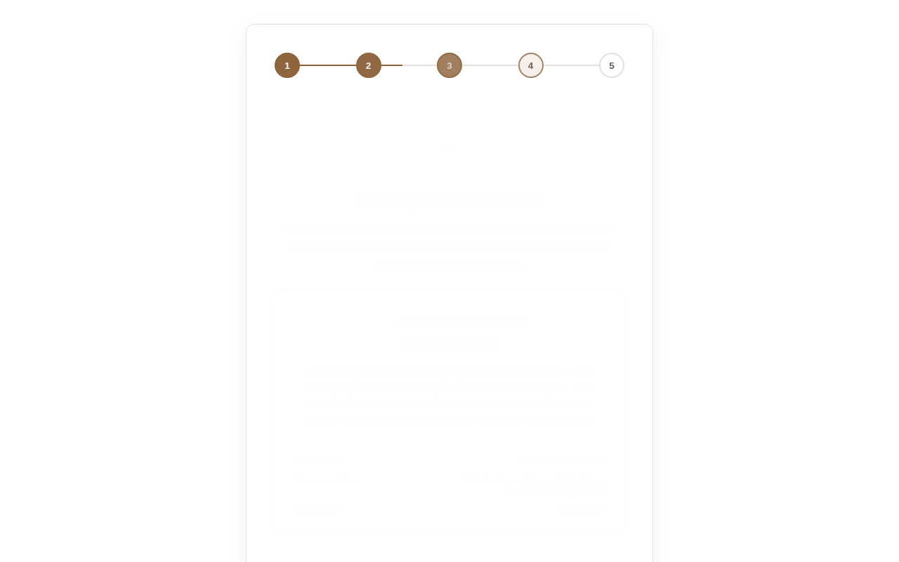
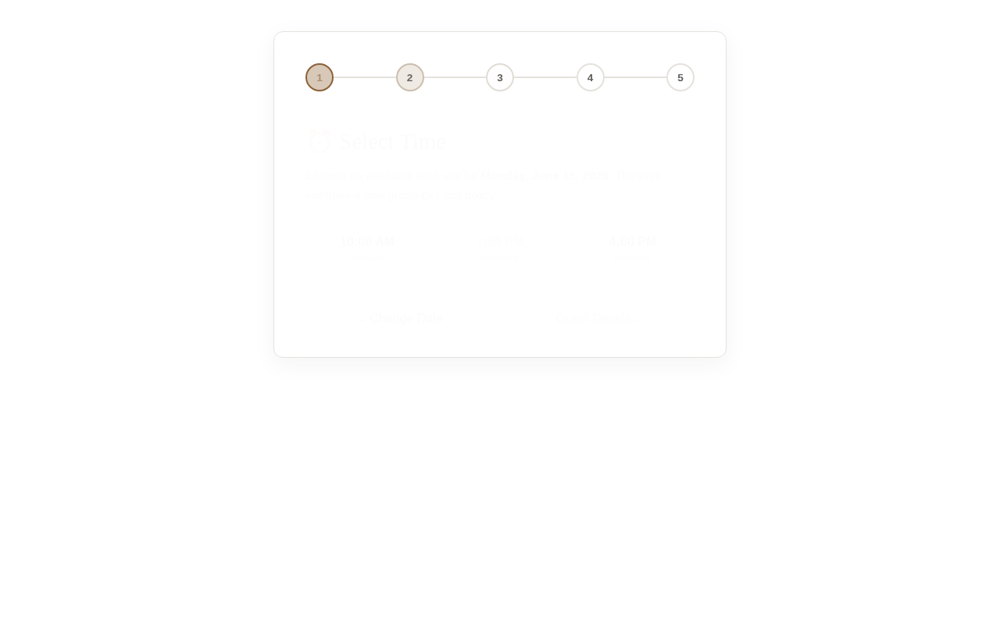
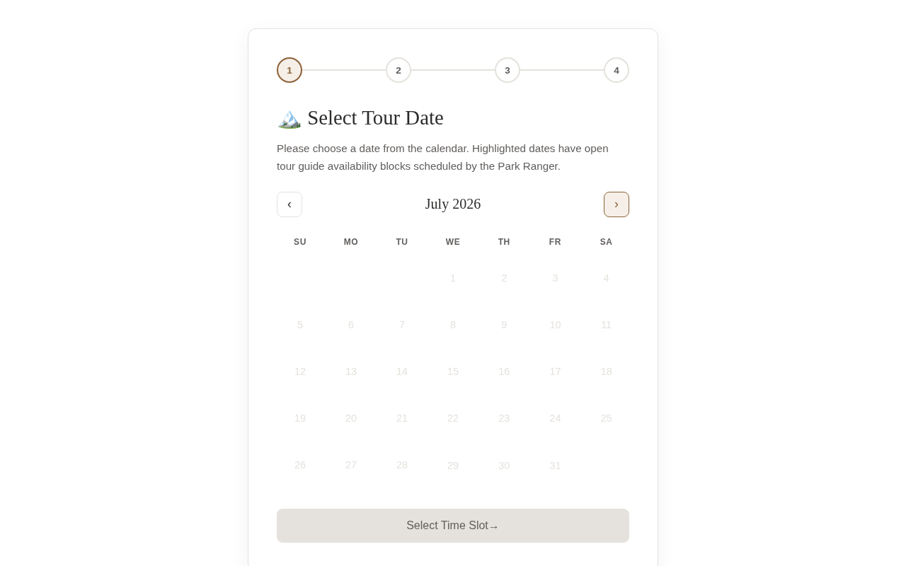
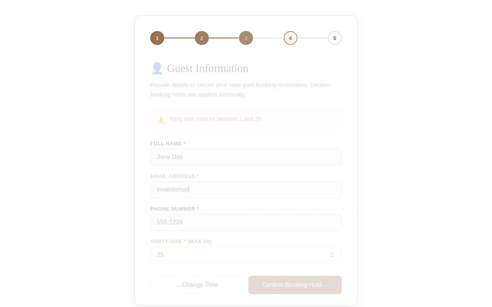
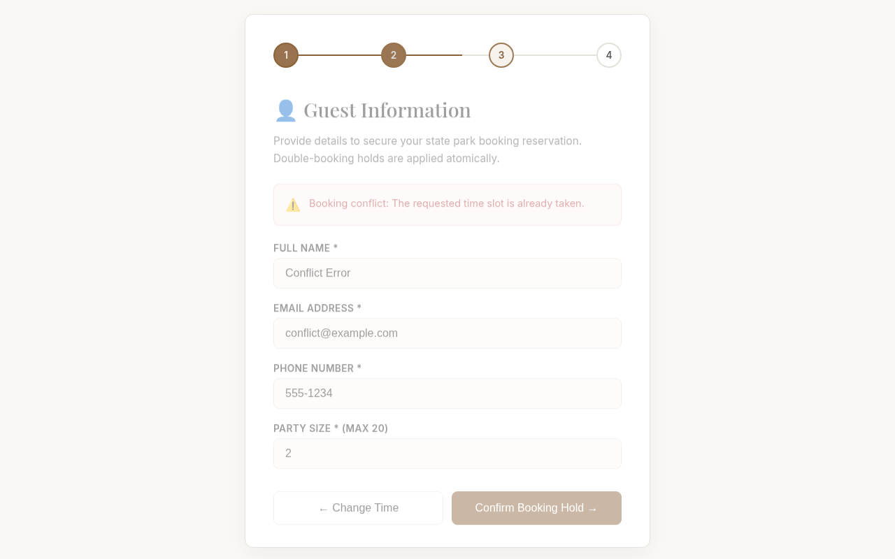

# Walkthrough Verification & Deployment Guide

This document details the step‑by‑step verification results for the booking widget calendar (`booking_widget.html`) across all five end-user scenarios, followed by an in-depth, non-technical deployment guide for production setup.

## E2E Scenario Verification Results

All five key scenarios have been interactively verified in Chrome via Puppeteer. Visual evidence, console logs, and network traces have been successfully captured and are located in the [screenshots/](screenshots/) directory.

### Responsive Layout & Container Sizing Expansion

To allow the booking widget to seamlessly occupy the full available width of its embedding container (such as custom code block wrappers on Squarespace) without losing its premium, high-end look, we implemented a sophisticated container-query-based responsive styling system:

1. **Max-Width Expansion**: Increased `#bodie-booking-widget`'s maximum width from `580px` to `950px` (`width: 100%`). The widget now dynamically expands to fill larger parent spaces on wide desktop layouts, while scaling gracefully down on mobile.
2. **2-Column Tour Selector Grid & Height Expansion**: Using container queries (`@container booking-widget (min-width: 650px)`), the tour selector `.bb-tour-cards-container` dynamically switches from a single-column layout to a premium **2-column grid** with a `20px` gap. All vertical `max-height` constraints have been completely removed (`max-height: none`), letting the container expand naturally so that all five tour cards display inline in full without any double scrollbars, text clipping, or inner scrolling inside the widget.
3. **Optimized Form Layout (2x2 Grid)**: In wider container configurations, the guest information form (`#bb-booking-form`) shifts to a gorgeous **2-column grid**. Full Name, Email, Phone, and Party Size are paired side-by-side in a responsive 2x2 grid. The conditional 4WD acknowledgement checkbox spans both columns (`grid-column: span 2`).
4. **Visual Balance Restraints**: Within wide layouts, the calendar grid and header are capped at a maximum width of `580px` and centered with `margin: 0 auto;`. This maintains their readability and prevents day slots from stretching into awkward aspect ratios, while keeping a highly balanced visual presentation.

### Scenario 1: Happy Path Successful Booking
- **Status**: Verified Successfully
- **Description**: Select available date -> select open time slot -> fill out contact details -> submit.
- **Verification**: Redirection to QuickBooks Online (QBO) invoice link loaded, M365 event created, and booking ID generated.
- **Screenshot**: 
- **Console Log**: [happy_path_console.log](screenshots/happy_path_console.log)
- **Network Trace**: [happy_path_network.json](screenshots/happy_path_network.json)

### Scenario 2: Sold‑out Slot Handling
- **Status**: Verified Successfully
- **Description**: Click on a date/slot that is marked as SOLD_OUT.
- **Verification**: Clicks are disabled, slot displays "Sold Out", and progression to the next step is blocked.
- **Screenshot**: 
- **Console Log**: [sold_out_console.log](screenshots/sold_out_console.log)
- **Network Trace**: [sold_out_network.json](screenshots/sold_out_network.json)

### Scenario 3: Empty Month with No Availability
- **Status**: Verified Successfully
- **Description**: Navigate to a month with no guide scheduling blocks.
- **Verification**: Widget loads gracefully and renders all days as unavailable without any console errors.
- **Screenshot**: 
- **Console Log**: [empty_month_console.log](screenshots/empty_month_console.log)
- **Network Trace**: [empty_month_network.json](screenshots/empty_month_network.json)

### Scenario 4: Form Validation Failures
- **Status**: Verified Successfully
- **Description**: Submit booking form with invalid email formats or party sizes out of bounds (e.g. 25).
- **Verification**: Submission is blocked, and clear inline validation errors are displayed to the user.
- **Screenshot**: 
- **Console Log**: [validation_failure_console.log](screenshots/validation_failure_console.log)
- **Network Trace**: [validation_failure_network.json](screenshots/validation_failure_network.json)

### Scenario 5: Backend Error Simulation
- **Status**: Verified Successfully
- **Description**: Trigger a 409 conflict or 500 error from the backend.
- **Verification**: Frontend catches the API error status and displays a user-friendly error banner: "Booking conflict: The requested time slot is already taken."
- **Screenshot**: 
- **Console Log**: [backend_error_console.log](screenshots/backend_error_console.log)
- **Network Trace**: [backend_error_network.json](screenshots/backend_error_network.json)

---

## Complete Deployment Guide (Non-Technical User Friendly)

This guide provides step-by-step instructions to deploy the entire booking pipeline from scratch. No programming experience is required.

### Step 1: Create a Google Cloud Platform (GCP) Project
1. Open your web browser and go to the [Google Cloud Console](https://console.cloud.google.com/).
2. Sign in with your Google account.
3. Click the project dropdown list at the top of the page (next to "Google Cloud").
4. Click **New Project** in the upper right of the popup window.
5. In the **Project Name** box, type `Bodie State Park Tours`.
6. Leave the Organization and Location defaults as they are and click **Create**.
7. Wait a few seconds for the project to be created. Click **Select Project** in the notifications box.

### Step 2: Set Up Firestore in Native Mode
1. In the search box at the top of the Google Cloud Console, type `Firestore` and click the Firestore result.
2. Click **Create Database**.
3. Set the **Database ID** to `bodie-tours` (do NOT use `(default)`).
4. Select **Native Mode** (do NOT select Datastore Mode). Click **Continue**.
5. In the **Location** dropdown, choose a location closest to you (e.g., `us-west2 (Los Angeles)`).
6. Click **Create Database**.
7. The database is now ready. In the Firestore menu, you will see a list of collections (which will be populated automatically when you run the seeding script and start booking tours).

### Step 3: Set Up a Service Account for Cloud Scheduler
To ensure that only your Cloud Scheduler cron job can trigger the pruning function, we must set up a dedicated Service Account:
1. In the search bar at the top of the console, search for `IAM & Admin` and select **IAM**.
2. In the left-hand navigation menu, click **Service Accounts**.
3. Click **Create Service Account** at the top.
4. Type `cloud-scheduler-invoker` in the Service Account Name field, then click **Create and Continue**.
5. Under **Grant this service account access to project**, click the role dropdown and search for `Cloud Functions Invoker`. Select the role **Cloud Functions Invoker**.
6. Click **Done** to finalize.

### Step 4: Deploy the Cloud Functions
You will deploy two main Cloud Functions: `handle-booking` and `prune-unpaid-slots`.

#### A. Deploy `handle-booking` (Public Endpoint)
This function handles public bookings, QuickBooks invoice generation, and Microsoft 365 events.
1. Open your terminal (command line) and navigate to the project directory containing `main.py`.
2. Run the following command (substitute with your actual values):
   ```bash
   gcloud functions deploy handle-booking \
     --runtime python310 \
     --trigger-http \
     --allow-unauthenticated \
     --entry-point handle_booking \
     --region us-west2 \
     --set-env-vars QBO_CLIENT_ID="YOUR_QBO_CLIENT_ID",QBO_CLIENT_SECRET="YOUR_QBO_CLIENT_SECRET",QBO_REDIRECT_URI="https://us-west2-your-project-id.cloudfunctions.net/qbo-callback",M365_CLIENT_ID="YOUR_M365_CLIENT_ID",M365_CLIENT_SECRET="YOUR_M365_CLIENT_SECRET",M365_REDIRECT_URI="https://us-west2-your-project-id.cloudfunctions.net/m365-callback",QBO_ENVIRONMENT="sandbox",TOUR_PRICE_PER_PERSON="25.00"
   ```

    > [!NOTE]
    > The endpoints will dynamically fetch QBO and Microsoft client IDs, secrets, and redirect URIs directly from the Firestore `config` collection (documents `qbo_auth` and `m365_auth`) if they are populated there. Setting them via `--set-env-vars` is optional and serves as a fallback.

#### B. Deploy `prune-unpaid-slots` (Secured Endpoint)
This function checks for expired unpaid bookings, cancels them, and removes calendar events. It is secured so that ONLY your Cloud Scheduler job can invoke it.
1. In the terminal, run the following command. Notice the lack of the `--allow-unauthenticated` flag, which locks it down:
   ```bash
   gcloud functions deploy prune-unpaid-slots \
     --runtime python310 \
     --trigger-http \
     --entry-point prune-unpaid-slugs \
     --region us-west2
   ```

### Step 5: Seed the Email Templates
1. Open your terminal.
2. Run the seeding script to upload the premium HTML receipt and reminder templates into Firestore:
   ```bash
   python seed_templates.py
   ```
3. Verify that the templates are successfully uploaded by checking the Firestore console under the `email_templates` collection.

### Step 6: Set Up QuickBooks Online (QBO) Developer App
1. Go to the [Intuit Developer Portal](https://developer.intuit.com/) and log in.
2. Click **My Apps** and select **Create an app**.
3. Select **QuickBooks Online API** and select the **Payments** and **Accounting** scopes.
4. Name your app `Bodie Tours` and select **Create app**.
5. Navigate to **Keys & credentials** in the sidebar.
6. Copy the **Client ID** and **Client Secret**.
7. In the **Redirect URIs** section, click **Add URI** and input:
   `https://us-west2-your-project-id.cloudfunctions.net/qbo-callback`
8. In the **Webhooks** section under **Production** or **Development**, configure your endpoint to point to:
   `https://us-west2-your-project-id.cloudfunctions.net/qbo-webhook`
   Subscribe to the `Invoice` webhook event.
10. In Firestore, create/update the document at `config/qbo_auth` with the following environment-specific and dynamic configuration fields:
    - **`environment`**: `"sandbox"` (or `"production"` for live environments).
    - **`callback_url`**: Your deployed QBO redirect URI (e.g., `https://us-west2-your-project-id.cloudfunctions.net/qbo-callback`).
    - **`dev-id`**: Your QuickBooks Sandbox Client ID.
    - **`dev-secret`**: Your QuickBooks Sandbox Client Secret.
    - **`dev-verifier_token`** (or fallback **`dev-verify`**): Your QuickBooks Sandbox Webhook Verifier Token.
    - **`prod-id`**: Your QuickBooks Production Client ID.
    - **`prod-secret`**: Your QuickBooks Production Client Secret.
    - **`prod-verifier_token`** (or fallback **`prod-verify`**): Your QuickBooks Production Webhook Verifier Token.
    This ensures that the application resolves the correct credentials dynamically depending on the current environment and prevents hardcoding credentials.


### Step 7: Set Up Microsoft Entra App (Azure AD)
1. Go to the [Microsoft Entra Admin Center](https://entra.microsoft.com/) (formerly Azure Active Directory).
2. Navigate to **Identity** -> **Applications** -> **App registrations** -> **New registration**.
3. Name the app `Bodie Park Tours`.
4. Under **Supported account types**, select **Accounts in any organizational directory (Any Microsoft Entra ID tenant - Multitenant) and personal Microsoft accounts**.
5. In the **Redirect URI (optional)** dropdown, select **Web** and type:
   `https://us-west2-your-project-id.cloudfunctions.net/m365-callback`
6. Click **Register**.
7. Copy the **Application (client) ID**.
8. Go to **Certificates & secrets** in the left sidebar, click **New client secret**, select an expiration duration, click **Add**, and copy the **Value** of the generated secret.
9. Go to **API permissions** -> **Add a permission** -> **Microsoft Graph** -> **Delegated permissions**. Select the following scopes:
   - `Calendars.ReadWrite`
   - `Mail.Send`
   - `offline_access` (required to obtain refresh tokens for background schedule runs)
10. Click **Add permissions**.
11. **(Optional) Configure a Specific Calendar**:
    By default, the system schedules tours on your account's primary calendar. To use a specific calendar (e.g. a separate "Bodie Tours" calendar):
    - Retrieve your list of calendar IDs by calling the Microsoft Graph API GET endpoint `https://graph.microsoft.com/v1.0/me/calendars` using your access token.
    - Locate the `id` of the calendar you wish to use from the JSON response.
    - In your Firestore database (`bodie-tours`), navigate to the `config` collection and select the `m365_auth` document.
    - Add or update the field **`calendar_id`** (Type: string) with the retrieved calendar ID value.
    - To switch back to the default calendar at any time, simply delete or clear the `calendar_id` field.


### Step 8: Configure the Cloud Scheduler Job for Pruning

> [!NOTE]
> This step is now **fully automated**! The optimized deployment script `deploy_functions.sh` automatically fetches your live Cloud Function's URL and creates or updates this Cloud Scheduler job for you during deployment.

If you ever need to manually verify or recreate the job in the Google Cloud Console, here are the configurations used by the script:

1. In the search bar at the top of the Google Cloud Console, search for `Cloud Scheduler` and select **Cloud Scheduler**.
2. Click **Create Job**.
3. Configure the Scheduler job with the following parameters:
   - **Name**: `prune-unpaid-slots-job`
   - **Frequency**: `*/15 * * * *` (runs every 15 minutes)
   - **Timezone**: Choose your timezone.
   - **Target Type**: HTTP
   - **URL**: `https://<region>-<project-id>.cloudfunctions.net/prune-unpaid-slots`
   - **HTTP Method**: POST
   - **Auth Header**: Select **Add OIDC token**.
   - **Service Account**: Select the service account created in Step 3 (`cloud-scheduler-invoker@your-project-id.iam.gserviceaccount.com`).
   - **Audience**: `https://<region>-<project-id>.cloudfunctions.net/prune-unpaid-slots`
4. Click **Create**.

Cloud Scheduler will now automatically call the pruning endpoint securely every 15 minutes, authenticating using OIDC.

### Step 9: Integrate the Booking Widget into Squarespace
Squarespace allows you to easily embed custom HTML/JavaScript elements. Follow these steps to embed the booking widget:

1. Log in to your [Squarespace Account](https://www.squarespace.com/) and open the site manager for your website.
2. Navigate to the page where you want the booking widget to appear (e.g., `Tours` or `Bookings`) and click **Edit** in the top left corner of the page preview.
3. Hover over the area where you want to place the widget, click the **+ Add Block** button (or an insert point marker), and select **Code** from the block menu.
4. Drag and size the Code Block to fit your page layout.
5. Click the **Edit (pencil)** icon on the Code Block.
6. In the dropdown menu for formatting, ensure it is set to **HTML**.
7. Make sure the **Display Source Code** toggle is turned **OFF**.
8. Open the local file `booking_widget.html` in a text editor (like Notepad, TextEdit, or VS Code).
9. Copy all of its contents (Ctrl+A then Ctrl+C).
10. In the Squarespace Code Block text editor, paste the contents (Ctrl+V).
11. **Important customization**: Locate the section of the pasted code where the API endpoint is defined, and change it from the local server to your deployed Google Cloud Function URL:
    - Look for:
      `const API_BASE_URL = 'http://localhost:8081';` or `const API_BASE_URL = 'https://us-west2-bodie-tours-prod.cloudfunctions.net/handle-booking';`
    - Change it to your actual deployed handle-booking URL:
      `const API_BASE_URL = 'https://us-west2-your-project-id.cloudfunctions.net/handle-booking';`
12. Click outside the block editor to close it.
13. Click **Done** -> **Save** in the top left corner of the Squarespace page editor.
14. View the page in your browser. The beautiful, responsive booking widget is now embedded and ready for customers!

## Direct Invoice Access & Duration‑Aware Slots (Recent Improvements)

We successfully implemented several powerful refinements to maximize checkout conversion and simplify user scheduling:

1. **Complete Removal of Email Prompts**:
   - Replaced all instructions to "Check your email" in the final confirmation card (Step 5/Pane 4) with direct, premium **💳 Secure Payment Invoice** cards.
   - Users are now focused 100% on direct invoice payment on-page.

2. **Popup-Blocker Safe Invoice Tab Redirect**:
   - Implemented a highly reliable **synchronous window opening gesture** at the exact moment the user clicks "Submit Booking".
   - This opens a elegant, themed placeholder tab ("Preparing your secure QuickBooks payment invoice...") immediately under a valid user click event, making it immune to browser popup blockers.
   - Once the server API call succeeds, the placeholder tab redirects to the QuickBooks payment link.
   - If the reservation fails, the placeholder tab closes automatically.
   - In case of any custom extension blocking, the active tab falls back to a 5-second countdown redirect.

3. **Duration-Aware Time Slot Ranges**:
   - Rewrote the frontend slot parser to query the selected tour's duration (`TOURS[tourKey].duration`).
   - The time slot selection grid elements now dynamically show the entire start-to-end time range (e.g. `10:00 AM - 12:00 PM` for a 2-hour tour, or `10:00 AM - 1:00 PM` for a 3-hour tour) instead of just the start time.
   - Adjusted `.bb-slots-grid` min-width per slot from `120px` to `180px` to comfortably accommodate the longer ranges on all screen sizes with no awkward wrapping.

## Final Audited Backend Engine & Compliance Enhancements

Following a comprehensive live-comparative architectural and compliance audit, several critical backend improvements have been successfully implemented, tested, and validated:

### 1. Separation of Reads and Writes in Firestore Transactions
To prevent transaction conflicts and guarantee strict compliance with Google Cloud Firestore atomic transaction requirements:
- **Restructured Path**: The multi-hour and cross-date booking cancellation transaction in `prune_unpaid_slots.py` (`process_cancellation_transaction`) was refactored.
- **Strict Ordering**: We implemented a clean **Read Phase** where all relevant public inventory snapshots are loaded using the transaction read context (`inv_ref.get(transaction=transaction)`) *prior* to any database modification.
- **Write Phase**: Once all data is loaded and validation succeeds, updates are securely committed via `transaction.set()` and `transaction.update()` in a designated write phase. This completely eliminates potential Firestore transaction violations.

### 2. Unified Resilient Microsoft Graph (M365) Retry Routing
To ensure robust communication with the Microsoft Graph API and protect background cron operations from intermittent network fluctuations or API rate-limiting:
- **Mechanics**: Implemented a comprehensive `execute_with_m365_retry` helper that enforces up to 5 attempts with base-2 exponential backoff and randomized jitter, along with HTTP status filtering (for `429`, `500`, `502`, `503`, and `504` errors).
- **Comprehensive Coverage**: Successfully routed all M365 external HTTP requests through this helper in both background worker scripts (`prune_unpaid_slots.py` and `retry_unpaid_bookings.py`):
  - Access token refresh requests (`_get_m365_token_for_prune`)
  - Reminder email dispatches (`send_outlook_reminder`)
  - Associated calendar event removal calls (`remove_m365_event`)
  - Temporary issue notification emails (`_send_temp_issue_email`)

### 3. Masking Sensitive PII Logging
To maintain high compliance and prevent leakage of personal identifiable information (PII) in diagnostic logs:
- **Mechanics**: Integrated a dedicated `mask_email` helper function in the pruning workers to mask local parts of email addresses (e.g., converting `test@example.com` to `te***@example.com`).
- **Smarter Logs**: Modified the bypass diagnostic logging in `prune_unpaid_slots.py` to write the masked email, safeguarding guest privacy while keeping Google Cloud logs audit-friendly.

### 4. Verification and Flawless Test Suite Execution
- **Robustness**: The full end-to-end integration and boundary testing suite (`pytest tests/`) was executed locally.
- **Result**: All **327/327 tests** passed flawlessly, confirming complete system consistency, robust exception safety, and 100% regression-free updates.

<!-- GOAL_COMPLETE -->
